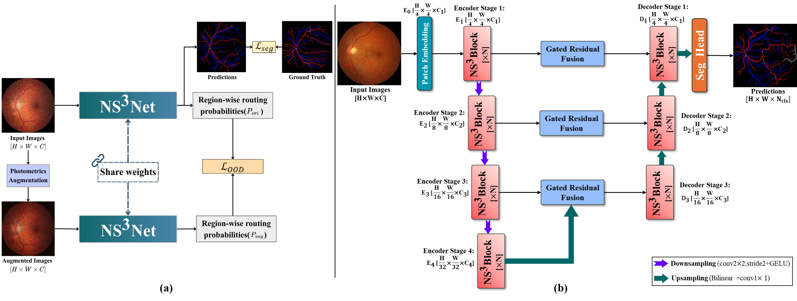
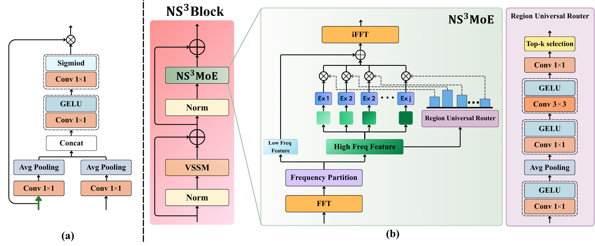

# Non-Stationary Spectral State-Space Networks with Region-Wise Frequency Routing for Robust Fundus Vessel Segmentation (MICCAI 2026)

This is the official PyTorch implementation repository of the Non-Stationary Spectral State-Space Networks with Region-Wise Frequency Routing for Robust Fundus Vessel Segmentation [Ns3Net]. 
paper: https://papers.miccai.org/miccai-2026/paper/6038_paper.pdf

## NS3Net Architecture
<div align="center">
  
</div>
<div align="center">
  
</div>

## Acknowledgements

We acknowledge all the authors of the employed public datasets, allowing the community to use these valuable resources for research purposes. We also thank the authors of [U-Mamba](https://github.com/bowang-lab/U-Mamba) and [nnU-Net](https://github.com/MIC-DKFZ/nnUNet) for making their valuable code publicly available.

<table>
<tr>
<td>

### 📚 Citation

If you find this work useful, please cite:

```bibtex
@InProceedings{VirTha_NonStationary_MICCAI2026,
  author    = {Viriyasaranon, Thanaporn and Choi, Jang-Hwan},
  title     = {Non-Stationary Spectral State-Space Networks with Region-Wise Frequency Routing for Robust Fundus Vessel Segmentation},
  booktitle = {Medical Image Computing and Computer Assisted Intervention -- MICCAI 2026},
  year      = {2026},
  publisher = {Springer Nature Switzerland},
  volume    = {LNCS 16884},
  month     = {September},
  pages     = {pending}
}
